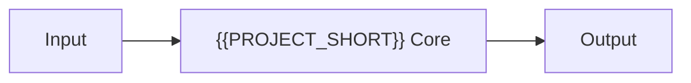

<!--
Copyright (c) {{COPYRIGHT_YEAR}} {{GITHUB_OWNER}}
SPDX-License-Identifier: {{LICENSE_ID}}
-->

<h1 align="center">
  {{PROJECT_SHORT}} - {{PROJECT_NAME}}
</h1>

<h4 align="center">{{PROJECT_DESC}}</h4>

<p align="center">
  <a href="https://github.com/sponsors/{{GITHUB_OWNER}}"></a>
  
  
  <a href="https://github.com/{{GITHUB_OWNER}}/{{PROJECT_SLUG}}/actions/workflows/ci.yml"></a>
  <a href="{{DOCS_URL}}"></a>
  <a href="https://www.bestpractices.dev/projects/{{OPENSSF_PROJECT_ID}}"></a>
  <a href="https://scorecard.dev/viewer/?uri=github.com/{{GITHUB_OWNER}}/{{PROJECT_SLUG}}"></a>
  
</p>

<p align="center">
  <a href="#features">Features</a> •
  <a href="#requirements">Requirements</a> •
  <a href="#installation">Installation</a> •
  <a href="#usage">Usage</a> •
  <a href="#how-it-works">How It Works</a> •
  <a href="#obtain-feedback--contributions">Contribute</a>
</p>

---

<!-- TODO(template): add a demo GIF or screenshot under assets/ and link it here. -->

---

## Why {{PROJECT_SHORT}}?

<!-- TODO(template): state the problem this project solves and how it differs from existing alternatives. Name at least one alternative and the concrete architectural advantage over it. -->

Key architectural advantages:

* **<!-- TODO(template): advantage 1 -->**
* **<!-- TODO(template): advantage 2 -->**
* **<!-- TODO(template): advantage 3 -->**

## Features

<!-- TODO(template): one bullet per user-visible capability. Bold the feature name, then explain the mechanism, not just the outcome. -->

* **Feature name**: description.

## Requirements

* **{{PRIMARY_LANGUAGE}} {{MIN_LANG_VERSION}}+**
<!-- TODO(template): list runtime, OS, and privilege requirements. -->

## Installation

<!-- TODO(template): document each supported install path, most-recommended first. -->

```bash
git clone https://github.com/{{GITHUB_OWNER}}/{{PROJECT_SLUG}}.git
cd {{PROJECT_SLUG}}
make setup
```

For instructions on verifying the integrity and authenticity of release assets, see the
[Release Verification Guide](docs/verification.md).

## Usage

For the complete list of commands, options, exit codes, and technical specifications, see the
[External Interfaces Reference](docs/interfaces.md).

### Quick Start

```bash
<!-- TODO(template): the shortest command sequence that produces value. -->
```

## How It Works



<!-- TODO(template): number the main execution steps, then link the architecture guide. -->

For a detailed walkthrough of the execution flows, trust boundaries, and modular components, see the:

**[Technical Architecture & Design Guide](docs/architecture.md)**

## Known Behavior & Limitations

> [!WARNING]
> <!-- TODO(template): document known limitations honestly. Users trust projects that state their limits. -->

For a full breakdown of residual risks and the STRIDE threat model, see
[`docs/security-assessment.md`](docs/security-assessment.md).

## Development & Testing

{{PROJECT_SHORT}} uses a **Makefile** to standardize the development pipeline.

> [!IMPORTANT]
> **Always run `make verify` before pushing code.** If it fails, the change is not ready.

| Command        | Goal                                                             |
| :------------- | :--------------------------------------------------------------- |
| `make setup`   | Bootstrap the development environment.                            |
| `make test`    | Run the unit test suite (fast, no privileges required).           |
| `make lint`    | Run linters, formatters (check mode), and static analysis.        |
| `make verify`  | Full local gate: lint + tests + dependency audit.                 |
| `make docs`    | Build the MkDocs documentation site.                              |
| `make build`   | Produce distributable artifacts.                                  |
| `make todo`    | List the documentation sections still to be filled in.            |
| `make help`    | Show every available target.                                      |

## Project Structure

```text
├── Makefile                # Developer entrypoint (see make/)
├── make/                   # Modular Makefile fragments
├── docs/                   # Technical documentation, ADRs, and the MkDocs site source
├── scripts/                # Installation, verification, and maintenance scripts
├── tests/                  # Test suites
└── {{PROJECT_PKG}}/        # Main source package
```

## Obtain, Feedback & Contributions

- **Obtain**: releases are published on the [GitHub Releases](https://github.com/{{GITHUB_OWNER}}/{{PROJECT_SLUG}}/releases) page.
- **Feedback**: report bugs or request features on the [GitHub Issues](https://github.com/{{GITHUB_OWNER}}/{{PROJECT_SLUG}}/issues) tracker.
- **Contribute**: read the [Contributing Guidelines](CONTRIBUTING.md) before submitting code.
- **Security**: review the [Security Policy](SECURITY.md) before reporting any vulnerability.

## Support

For version support status, EOL information, and support channels, see the [Support Policy](SUPPORT.md).

<div align="center">

If you find **{{PROJECT_SHORT}}** useful, please consider giving it a **Star**!

[](https://github.com/{{GITHUB_OWNER}}/{{PROJECT_SLUG}})

</div>

## License

{{LICENSE_ID}}. See [LICENSE](LICENSE) for more information.
