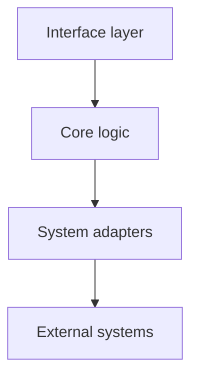

<!--
Copyright (c) {{COPYRIGHT_YEAR}} {{GITHUB_OWNER}}
SPDX-License-Identifier: {{LICENSE_ID}}
-->

# {{PROJECT_SHORT}} — Technical Architecture & Design

This document is the authoritative description of how {{PROJECT_SHORT}} is built. It is written for
contributors and for reviewers assessing the design; end-user instructions live in the
[README](../README.md) and the [documentation site]({{DOCS_URL}}).

## Table of Contents

1. [Project Goal](#1-project-goal)
2. [Module Architecture](#2-module-architecture)
3. [Module Details](#3-module-details)
4. [Data & Control Flow](#4-data--control-flow)
5. [Dependencies](#5-dependencies)
6. [Project Structure](#6-project-structure)
7. [Deployment & Installation Logic](#7-deployment--installation-logic)
8. [Development & Test Environment](#8-development--test-environment)

---

## 1. Project Goal

<!-- TODO(template): state the goal in two or three sentences, and the non-goals immediately after.
     A reader must be able to tell from this section whether the project fits their problem. -->

**Non-goals:**

- <!-- TODO(template) -->

---

## 2. Module Architecture



<!-- TODO(template): describe each layer, and state the dependency rule between them (which layer is
     allowed to import which). This rule is what `make lint` enforces. -->

| Layer | Responsibility | May depend on |
| :---- | :------------- | :------------ |
| Interface | Argument parsing, presentation | Core |
| Core | Business logic, pure functions | — |
| Adapters | I/O, subprocesses, network, filesystem | Core |

---

## 3. Module Details

### `{{PROJECT_PKG}}/<module>.py`

<!-- TODO(template): one subsection per module. For each, document: responsibility, public functions,
     invariants it maintains, and failure modes. -->

---

## 4. Data & Control Flow

<!-- TODO(template): walk through the primary execution path end to end, numbered. Include what
     happens on failure at each step. -->

1. <!-- TODO -->

---

## 5. Dependencies

The authoritative inventory, with licenses and security justifications, is in
[`DEPENDENCIES.md`](../DEPENDENCIES.md).

---

## 6. Project Structure

```text
<!-- TODO(template): annotated tree of the repository. -->
```

---

## 7. Deployment & Installation Logic

<!-- TODO(template): document what the installer does, in order, and what it changes on the host.
     Anything that modifies system state must be listed, along with its rollback. -->

---

## 8. Development & Test Environment

| Command                  | Purpose                                        |
| :----------------------- | :--------------------------------------------- |
| `make setup`             | Bootstrap the development environment.         |
| `make test`              | Unit tests, no privileges required.            |
| `make integration-test`  | Integration tests in a container or VM.        |
| `make verify`            | Full local gate before pushing.                |

<!-- TODO(template): document the test strategy — what is mocked, what is real, and why. -->
