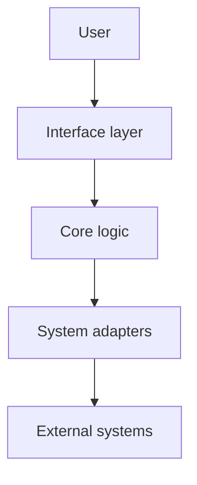

# Explanation: System Architecture

This page explains **why** {{PROJECT_SHORT}} is built the way it is. For the exhaustive internal
reference, see [`docs/architecture.md`](https://github.com/{{GITHUB_OWNER}}/{{PROJECT_SLUG}}/blob/main/docs/architecture.md)
in the repository; for the decision history, see the
[ADRs](https://github.com/{{GITHUB_OWNER}}/{{PROJECT_SLUG}}/tree/main/docs/decisions).

---

## 1. System Layer Diagram

<!-- TODO(template): explain the diagram in prose. A diagram without a narrative is decoration. -->

## 2. Design Principles

<!-- TODO(template): the constraints that shaped the design, and what each one rules out. -->

## 3. Execution Flow

<!-- TODO(template): the main flow, step by step, including failure handling. -->

## 4. Trust Boundaries

Summarized here; the full analysis lives in the
[security assessment](https://github.com/{{GITHUB_OWNER}}/{{PROJECT_SLUG}}/blob/main/docs/security-assessment.md).

<!-- TODO(template) -->
